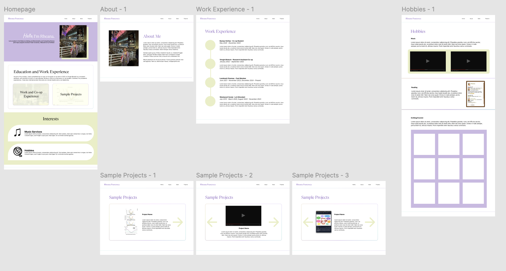

# CMPT 276 Mini-Project: Portfolio Website

This is my portfolio website deployed on GitHub pages for my CMPT 276 mini-project.

### Website Wireframe

*Figure 1. Portfolio website wireframe developed on Figma*

I used Figma to develop a wireframe for my website. I developed the five pages (homepage, about page, work experience page, hobbies page, and sample projects page), with the sample projects page having 3 sections to represent a carousel I wanted to try implementing for that page.

The wireframe on Figma can be viewed [here](https://www.figma.com/design/XnQPadBy0fHIDZAwG5Vmz4/Mini-Project-Wireframe?node-id=0-1&t=lYShBfGfCY0gTP4B-1).

### License
This repository uses the MIT license. I chose the MIT license because I am comfortable with and open to other users using and modifying the code in this repository.

### References
- https://sharkcoder.com
- https://webdesign.tutsplus.com/how-to-build-a-simple-carousel-with-vanilla-javascript--cms-41734t
- https://css-tricks.com/gradient-borders-in-css/
- https://www.w3schools.com/css/